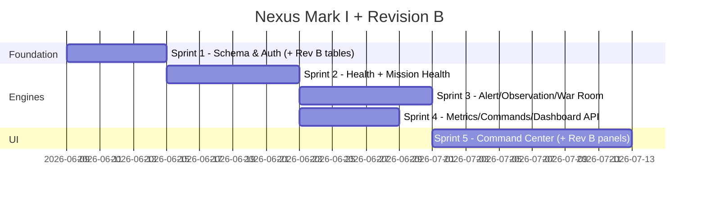

# PROJECT NEXUS — REVISION B ARCHITECTURE ADDENDUM

**Extends:** Nexus Mark I Architecture Blueprint (approved foundation)  
**Version:** Mark I + Revision B  
**Status:** Architecture only — no implementation

This document extends Mark I. It does not replace the original blueprint. All Mark I systems (events, alerts, incidents, memory, health engine, owner auth, folder structure) remain in force. Revision B adds **Observations**, **Commands**, **War Rooms**, and **Mission Health**, and updates the dashboard layout and sprint roadmap accordingly.

---

## Revision B Summary

| Addition | Mark I Scope | Mark II+ Scope |
|---|---|---|
| **Observations** | Rule-based conclusions from metrics/events | AI-generated insights, semantic correlation |
| **Commands** | History + pending recommendations (no execution) | Ask Nexus → command suggestions |
| **War Rooms** | Auto-created on critical incidents; grouped view | AI root-cause analysis, action synthesis |
| **Mission Health** | Workflow scoring from probes + DB signals | Predictive degradation, per-workflow AI |

**Strategic shift:** Nexus moves from *monitoring dashboard* to *intelligent operations system*. Raw telemetry (events) is separated from interpreted meaning (observations), and member-facing workflow health (mission) is separated from infrastructure health (integrations).

---

## 1. NEXUS OBSERVATIONS

### 1.1 Purpose

`nexus_observations` stores **conclusions**, not raw events.

| Layer | Question Answered | Example |
|---|---|---|
| `nexus_events` | What happened? | `signup.completed` count dropped to 12 today |
| `nexus_observations` | What does it mean? | Signup completion rate appears degraded vs 7-day average |
| `nexus_alerts` | Should the owner act? | WARNING: Signup rate declining |
| `nexus_ai_memory` | What should Nexus remember? | Jun 6 — Signup decline correlated with deploy v2.1 |

Observations are the bridge between telemetry and intelligence. Mark I generates them via **rule-based evaluators** over metrics and events. Mark II adds **LLM-generated observations** with the same schema.

### 1.2 Table: `nexus_observations`

| Column | Type | Constraints | Purpose |
|---|---|---|---|
| `id` | `uuid` | PK, `gen_random_uuid()` | |
| `observation_type` | `text` | NOT NULL | `trend`, `anomaly`, `correlation`, `regression`, `milestone`, `summary` |
| `category` | `text` | NOT NULL | `revenue`, `growth`, `commerce`, `infra`, `mission`, `security`, `deployment` |
| `severity` | `text` | NOT NULL, CHECK | `info`, `warning`, `critical` — informational weight, not always actionable |
| `confidence` | `numeric(4,3)` | NOT NULL, CHECK 0–1 | 0.000–1.000; rule-based default 0.700–0.950; AI lower until validated |
| `title` | `text` | NOT NULL | Short conclusion |
| `summary` | `text` | NOT NULL | Full explanation in plain language |
| `evidence` | `jsonb` | NOT NULL, default `{}` | Structured proof: `{ metric_key, before, after, delta_pct, window }` |
| `source` | `text` | NOT NULL | `rule_engine`, `collector`, `manual`, `ai` (Mark II) |
| `rule_id` | `text` | nullable | Observation rule that produced this |
| `status` | `text` | NOT NULL, CHECK | `active`, `superseded`, `dismissed`, `confirmed` |
| `dismissed_at` | `timestamptz` | nullable | Owner dismissed as noise |
| `dismissed_by` | `uuid` | FK → `profiles`, nullable | |
| `superseded_by` | `uuid` | FK → `nexus_observations`, nullable | Newer observation replaces this |
| `incident_id` | `uuid` | FK → `nexus_incidents`, nullable | Linked incident if escalated |
| `war_room_id` | `uuid` | FK → `nexus_war_rooms`, nullable | Linked war room |
| `occurred_at` | `timestamptz` | NOT NULL | When the condition was true |
| `valid_until` | `timestamptz` | nullable | Auto-expire stale observations |
| `metadata` | `jsonb` | NOT NULL, default `{}` | Tags, environment, git SHA at time of observation |
| `created_at` | `timestamptz` | NOT NULL, default `now()` | |
| `updated_at` | `timestamptz` | NOT NULL, default `now()` | |

### 1.3 Junction Tables (Source References)

Observations reference source data without duplicating it.

#### `nexus_observation_events`

| Column | Type | Constraints |
|---|---|---|
| `observation_id` | `uuid` | FK → `nexus_observations`, PK part |
| `event_id` | `uuid` | FK → `nexus_events`, PK part |
| `relevance` | `text` | `primary`, `supporting` |

#### `nexus_observation_metrics`

| Column | Type | Constraints |
|---|---|---|
| `observation_id` | `uuid` | FK → `nexus_observations`, PK part |
| `snapshot_id` | `uuid` | FK → `nexus_metrics_snapshots`, PK part |
| `role` | `text` | `baseline`, `current`, `comparison` |

#### `nexus_observation_alerts`

| Column | Type | Constraints |
|---|---|---|
| `observation_id` | `uuid` | FK → `nexus_observations`, PK part |
| `alert_id` | `uuid` | FK → `nexus_alerts`, PK part |
| `relationship` | `text` | `triggered_by`, `related`, `escalated_to` |

### 1.4 Indexes

- `nexus_observations_status_severity_idx` on `(status, severity, occurred_at DESC)` WHERE `status = 'active'`
- `nexus_observations_category_idx` on `(category, occurred_at DESC)`
- `nexus_observations_confidence_idx` on `(confidence DESC)` WHERE `status = 'active'`
- `nexus_observations_incident_idx` on `(incident_id)` WHERE `incident_id IS NOT NULL`
- `nexus_observation_events_event_idx` on `(event_id)`

### 1.5 Relationships

```
nexus_metrics_snapshots ──┐
nexus_events ─────────────┼──▶ nexus_observations ──▶ nexus_alerts
                          │         │
                          │         ├──▶ nexus_incidents
                          │         └──▶ nexus_war_rooms
                          │
nexus_alert_rules ────────┘ (observation rules, separate from alert rules)
```

**Flow:**
1. Metrics rollup or event batch completes.
2. Observation engine evaluates rules.
3. Matching rules create `nexus_observations` with junction references.
4. High-severity observations may **suggest** alerts (observation → alert), not replace the alert engine.
5. Critical observations with incident context link to `nexus_incidents` / `nexus_war_rooms`.

### 1.6 Mark I Observation Rules (Rule-Based)

| Rule ID | Input | Conclusion Template | Confidence |
|---|---|---|---|
| `obs.revenue.decline` | `revenue.mrr` daily vs 7d avg | Revenue declined {delta_pct}% compared to the previous 7-day average | 0.85 |
| `obs.blackcard.conversion.drop` | Blackcard conversion + recent deploy event | Blackcard conversions dropped after the latest onboarding change | 0.75 |
| `obs.mission.meet_errors` | Meet creation error events + deploy | Meet creation errors increased after the last deployment | 0.80 |
| `obs.growth.signup_completion` | Signup started vs completed ratio | Signup completion rate appears degraded | 0.82 |
| `obs.mission.workflow.degraded` | Mission Health score drop > 15% | Member workflow "{workflow}" is experiencing elevated failure rate | 0.88 |
| `obs.deploy.correlation` | Post-deploy metric shift | {metric} shifted {delta_pct}% within 2h of deployment {sha} | 0.70 |

**Dedup:** `dedupe_key = "{rule_id}:{category}:{date}"`. Supersede prior active observation when a newer one fires for the same key.

### 1.7 Observation Engine

**Location:** `lib/observations/engine.ts`, `lib/observations/rules.ts`

**Trigger:** `/api/cron/nexus/observation-engine` (every 15 minutes, after metrics rollup).

```
metrics_snapshots + recent events
        │
        ▼
  Rule Evaluator
        │
        ▼
  Create observation + junction refs
        │
        ├──▶ Optional: suggest alert (if severity >= warning)
        ├──▶ Optional: link to open incident
        └──▶ Optional: create memory entry (importance >= 7)
```

### 1.8 Dashboard Placement

**Observations Panel** — positioned below AI Status Panel and Mission Health, above System Health Grid.

| Element | Behavior |
|---|---|
| Active observations | Top 5 by severity × confidence, active only |
| Each row | Title, severity badge, confidence %, category tag, relative time |
| Expand | Summary + evidence metrics + linked event count |
| Actions | Dismiss, Confirm (owner feedback for Mark II training) |
| Empty state | "No significant patterns detected" |

**Full view:** `/admin/nexus/observations` — filterable by category, severity, status.

### 1.9 Future AI Usage (Mark II)

| Capability | Implementation |
|---|---|
| AI-generated observations | `source = 'ai'`, lower default confidence (0.55–0.75) |
| Ask Nexus context | Observations included in context builder (high priority) |
| Confidence calibration | Owner `confirmed` / `dismissed` feedback adjusts future weighting |
| Semantic correlation | LLM identifies cross-category patterns rules miss |
| Embedding | Optional `embedding vector(1536)` column (Mark II migration) for similarity search |

**AI safety:** AI observations never auto-create alerts at `critical` severity. Max auto-severity = `warning`. Owner must escalate.

### 1.9 API Endpoints (New)

| Method | Endpoint | Purpose |
|---|---|---|
| `GET` | `/api/nexus/observations` | Paginated list |
| `GET` | `/api/nexus/observations/[id]` | Detail with source refs |
| `PATCH` | `/api/nexus/observations/[id]` | Dismiss / confirm |
| `GET` | `/api/cron/nexus/observation-engine` | Cron trigger |

### 1.10 Folder Additions

```
lib/observations/
  engine.ts
  rules.ts
  evaluator.ts
  deduplication.ts
  types.ts

components/nexus/panels/
  ObservationsPanel.tsx

app/admin/nexus/observations/
  page.tsx
```

---

## 2. NEXUS COMMANDS

### 2.1 Purpose

`nexus_commands` stores **intent records** — things Nexus (or the owner) wants done. Mark I is **recommendation and history only**. No command mutates external systems. No rollbacks, no deploys, no Stripe refunds.

Commands are the precursor to Mark IV automation.

### 2.2 Table: `nexus_commands`

| Column | Type | Constraints | Purpose |
|---|---|---|---|
| `id` | `uuid` | PK | |
| `command_type` | `text` | NOT NULL | See §2.3 |
| `title` | `text` | NOT NULL | Human-readable label |
| `description` | `text` | NOT NULL | What this command would do |
| `status` | `text` | NOT NULL, CHECK | See §2.4 lifecycle |
| `origin` | `text` | NOT NULL | `owner`, `system`, `observation`, `alert`, `ai` |
| `risk_level` | `text` | NOT NULL, CHECK | `none`, `low`, `medium`, `high` |
| `approval_required` | `boolean` | NOT NULL, default `true` | Mark I: always true for `risk_level != 'none'` |
| `approved_at` | `timestamptz` | nullable | |
| `approved_by` | `uuid` | FK → `profiles`, nullable | Must be platform owner |
| `rejected_at` | `timestamptz` | nullable | |
| `rejected_by` | `uuid` | FK → `profiles`, nullable | |
| `executed_at` | `timestamptz` | nullable | Mark IV: when automation runs |
| `execution_result` | `jsonb` | nullable | Mark IV: outcome payload |
| `observation_id` | `uuid` | FK → `nexus_observations`, nullable | Source observation |
| `alert_id` | `uuid` | FK → `nexus_alerts`, nullable | Source alert |
| `incident_id` | `uuid` | FK → `nexus_incidents`, nullable | |
| `war_room_id` | `uuid` | FK → `nexus_war_rooms`, nullable | |
| `payload` | `jsonb` | NOT NULL, default `{}` | Command-specific parameters |
| `expires_at` | `timestamptz` | nullable | Pending commands expire after 7 days |
| `metadata` | `jsonb` | NOT NULL, default `{}` | |
| `created_at` | `timestamptz` | NOT NULL, default `now()` | |
| `updated_at` | `timestamptz` | NOT NULL, default `now()` | |

### 2.3 Command Types (Mark I)

| `command_type` | Risk | Mark I Behavior | Mark IV Behavior |
|---|---|---|---|
| `report.weekly` | none | Generate static report view | Scheduled PDF/email |
| `investigate.stripe_failures` | low | Open filtered event view | Auto-query + summarize |
| `investigate.deployment` | low | Open deployment detail | Fetch logs, diff |
| `recommend.rollback` | high | Display recommendation only | Requires approval + CI trigger |
| `incident.summary` | none | Generate markdown summary | Auto-post to memory |
| `review.alert` | none | Navigate to alert detail | — |
| `review.observation` | none | Navigate to observation | — |
| `mission.health_check` | low | Re-run mission probes | — |

### 2.4 Command Lifecycle

```
                    ┌─────────────┐
                    │  suggested  │  System/AI creates recommendation
                    └──────┬──────┘
                           │
              ┌────────────┼────────────┐
              ▼            ▼            ▼
        ┌──────────┐ ┌──────────┐ ┌──────────┐
        │ pending  │ │ rejected │ │ expired  │
        │ approval │ │          │ │          │
        └────┬─────┘ └──────────┘ └──────────┘
             │
             ▼
        ┌──────────┐
        │ approved │  Owner explicitly approves
        └────┬─────┘
             │
    Mark I   ▼
        ┌──────────┐
        │ completed│  "Completed" = owner acknowledged / viewed result
        │ (manual) │  No side effects
        └──────────┘

    Mark IV  ▼
        ┌──────────┐     ┌────────┐
        │ executing│────▶│ failed │
        └────┬─────┘     └────────┘
             ▼
        ┌──────────┐
        │ executed │
        └──────────┘
```

**Mark I terminal states:** `completed` (owner acted manually), `rejected`, `expired`, `dismissed`.  
**Mark I never enters:** `executing`, `executed`, `failed`.

### 2.5 Approval States

| Status | Meaning | Owner Action |
|---|---|---|
| `suggested` | Informational recommendation, no approval needed to view | View, dismiss |
| `pending_approval` | Action recommendation requiring owner consent | Approve, reject |
| `approved` | Owner approved; Mark I marks complete when owner follows through manually | Mark complete |
| `rejected` | Owner declined | — |
| `completed` | Resolved (manual follow-through in Mark I) | — |
| `expired` | No action within `expires_at` | — |
| `dismissed` | Owner dismissed without decision | — |

### 2.6 Audit Logging

Every command state transition writes to `nexus_activity_log`:

| Action | `actor_type` | Details |
|---|---|---|
| `command.created` | `system` / `ai` / `owner` | `command_type`, `origin`, `risk_level` |
| `command.approved` | `owner` | `command_id`, `approved_by` |
| `command.rejected` | `owner` | `command_id`, `reason` |
| `command.completed` | `owner` | `command_id` |
| `command.expired` | `system` | `command_id` |

### 2.7 AI Safety Controls

| Control | Mark I | Mark IV |
|---|---|---|
| AI cannot auto-approve | Enforced | Enforced |
| `risk_level = high` always requires owner approval | Enforced | Enforced |
| AI-origin commands capped at `risk_level = medium` | Enforced | Enforced |
| No command payload may contain secrets | Payload sanitized on write | Enforced |
| Kill switch: `platform_settings.nexus_commands_enabled` | Default `true` (suggestions only) | Required for execution |
| Execution kill switch: `platform_settings.nexus_automation_enabled` | Default `false` | Must be `true` |
| Command allowlist | `lib/commands/allowlist.ts` | Only allowlisted types executable |

### 2.8 Command Generation (Mark I)

Commands are suggested by:

1. **Observation engine** — e.g., deploy correlation → `recommend.rollback` (risk: high, pending_approval)
2. **Alert engine** — e.g., Stripe failures → `investigate.stripe_failures` (risk: low, suggested)
3. **War Room** — e.g., open incident → `incident.summary` (risk: none, suggested)
4. **Owner manual** — owner creates from Commands panel (origin: `owner`)

**Location:** `lib/commands/engine.ts`, `lib/commands/suggestions.ts`, `lib/commands/allowlist.ts`

### 2.9 Dashboard Placement

**Commands / Recommendations Panel** — right column, below Alerts Center.

| Element | Behavior |
|---|---|
| Pending approvals | Highlighted with crimson border, count badge |
| Suggested commands | Lower emphasis, dismissable |
| Recent history | Last 5 completed/rejected |
| Actions | Approve, Reject, View, Mark Complete, Dismiss |

**Full view:** `/admin/nexus/commands`

### 2.10 API Endpoints (New)

| Method | Endpoint | Purpose |
|---|---|---|
| `GET` | `/api/nexus/commands` | List commands |
| `POST` | `/api/nexus/commands` | Owner creates manual command |
| `GET` | `/api/nexus/commands/[id]` | Detail |
| `PATCH` | `/api/nexus/commands/[id]` | Approve / reject / complete / dismiss |
| `GET` | `/api/cron/nexus/command-expiry` | Expire stale pending commands (daily) |

### 2.11 Future Automation Support (Mark IV)

```
nexus_commands (approved)
        │
        ▼
  Command Executor (lib/commands/executor.ts)
        │
        ├──▶ Tool Registry (lib/ai/tool-registry.ts)
        ├──▶ Integration clients (read-only first, then write)
        └──▶ Result → execution_result + nexus_activity_log
```

Pre-baked in Mark I:
- `payload` schema per `command_type` documented in `lib/commands/schemas.ts`
- `risk_level` and `approval_required` on every row
- `execution_result` column (nullable until Mark IV)

### 2.12 Folder Additions

```
lib/commands/
  engine.ts
  suggestions.ts
  allowlist.ts
  schemas.ts
  types.ts
  executor.ts          # Stub only in Mark I

components/nexus/panels/
  CommandsPanel.tsx

app/admin/nexus/commands/
  page.tsx
```

---

## 3. WAR ROOM MODE

### 3.1 Purpose

When a **critical incident** occurs, Nexus elevates from monitoring to **active incident command**. A War Room groups everything needed to understand, respond to, and resolve a major failure.

War Rooms are the owner’s incident workspace — not just a filtered view.

### 3.2 Table: `nexus_war_rooms`

| Column | Type | Constraints | Purpose |
|---|---|---|---|
| `id` | `uuid` | PK | |
| `incident_id` | `uuid` | FK → `nexus_incidents`, UNIQUE, NOT NULL | 1:1 with incident |
| `title` | `text` | NOT NULL | e.g., "Stripe Webhook Outage — War Room" |
| `status` | `text` | NOT NULL, CHECK | `active`, `stabilizing`, `resolved`, `archived` |
| `severity` | `text` | NOT NULL | Inherited from incident |
| `impact_summary` | `text` | nullable | Owner-editable: who/what affected |
| `root_cause` | `text` | nullable | Owner-editable; AI-suggested in Mark II |
| `resolution_summary` | `text` | nullable | Final postmortem note |
| `owner_notes` | `text` | nullable | Freeform owner notes (markdown) |
| `timeline` | `jsonb` | NOT NULL, default `[]` | `[{ at, type, title, actor, ref_id }]` |
| `recommended_actions` | `jsonb` | NOT NULL, default `[]` | `[{ command_id, title, risk, status }]` |
| `activated_at` | `timestamptz` | NOT NULL, default `now()` | |
| `stabilized_at` | `timestamptz` | nullable | |
| `resolved_at` | `timestamptz` | nullable | |
| `archived_at` | `timestamptz` | nullable | |
| `metadata` | `jsonb` | NOT NULL, default `{}` | |
| `created_at` | `timestamptz` | NOT NULL, default `now()` | |
| `updated_at` | `timestamptz` | NOT NULL, default `now()` | |

### 3.3 When a War Room Is Created

| Trigger | Auto-Create? | Notes |
|---|---|---|
| Incident severity = `critical` | Yes | Immediate |
| 3+ active critical alerts within 30 min | Yes | Creates incident + war room |
| Integration `down` for > 10 min | Yes | Per incident-manager rules |
| Mission Health score < 50 | Yes | Member workflows severely degraded |
| Owner manual activation | Yes | From incident detail page |
| Warning-severity incident | No | Incident exists, no war room |

**Creator:** `lib/war-room/manager.ts` called from `lib/alerts/incident-manager.ts`.

### 3.4 Relationship to Incidents

```
nexus_incidents (1) ────── (1) nexus_war_rooms
       │                              │
       ├── nexus_alerts (many)        ├── timeline (embedded)
       ├── nexus_events (many)        ├── recommended_actions
       └── nexus_observations (many)  ├── nexus_commands (many)
                                      └── owner_notes
```

- Every War Room has exactly one incident.
- Not every incident has a War Room (warnings only).
- War Room status tracks the **response phase**; incident status tracks the **technical state**.
- Resolving a War Room does not auto-resolve the incident (owner may keep incident open for postmortem).

### 3.5 War Room Contents (Aggregated)

| Section | Data Source |
|---|---|
| **Incident header** | `nexus_incidents` — title, severity, status, started_at |
| **Impact summary** | `nexus_war_rooms.impact_summary` + auto-generated from affected integrations/workflows |
| **Active alerts** | `nexus_alerts` WHERE `incident_id` AND `status = 'active'` |
| **Related events** | `nexus_events` via `correlation_id` or time window ± incident.started_at |
| **Observations** | `nexus_observations` WHERE `incident_id` or `war_room_id` |
| **Timeline** | Merged: incident timeline + war room timeline + deployment events |
| **Root cause** | Owner-editable; Mark II: AI suggestion from event correlation |
| **Recommended actions** | `nexus_commands` WHERE `war_room_id` AND `status IN (suggested, pending_approval)` |
| **Owner notes** | `nexus_war_rooms.owner_notes` |
| **Resolution** | `resolution_summary` + link to `nexus_ai_memory` postmortem |

### 3.6 UI Architecture

**War Room Panel (Dashboard)** — appears **only when an active war room exists**. Otherwise hidden (not empty — absent).

| State | Dashboard Behavior |
|---|---|
| No active war room | Panel not rendered |
| Active war room | Full-width crimson-bordered panel at top, below AI Status |
| Multiple active | Show highest severity; badge "2 active" links to list |

**War Room Panel contents:**
- Title + duration timer
- Impact summary (1–2 lines)
- Alert count + top observation
- Top 2 recommended actions with approve buttons
- "Enter War Room →" link to `/admin/nexus/war-room/[id]`

**Full War Room page:** `/admin/nexus/war-room/[id]`

```
┌─────────────────────────────────────────────────────────────────┐
│  ⚠ WAR ROOM: Stripe Webhook Outage          Active — 47 min  │
├─────────────────────────────────────────────────────────────────┤
│  IMPACT          │  ROOT CAUSE (editable)    │  OWNER NOTES     │
│  Auto-generated  │  [textarea]               │  [textarea]      │
├──────────────────┴───────────────────────────┴──────────────────┤
│  TIMELINE (merged, chronological)                               │
│  14:32 — Alert: Stripe webhook failures (critical)              │
│  14:33 — Observation: Revenue processing may be affected        │
│  14:35 — Command suggested: Investigate Stripe failures         │
│  14:40 — Owner note: "Checking Stripe dashboard"              │
├─────────────────────────────────────────────────────────────────┤
│  ACTIVE ALERTS (3)  │  RELATED EVENTS (12)  │  OBSERVATIONS (2)│
├─────────────────────────────────────────────────────────────────┤
│  RECOMMENDED ACTIONS                                            │
│  [Approve] Investigate Stripe failures                          │
│  [Approve] Generate incident summary                            │
├─────────────────────────────────────────────────────────────────┤
│  RESOLUTION                                                     │
│  [textarea] + [Mark Resolved] [Archive War Room]              │
└─────────────────────────────────────────────────────────────────┘
```

### 3.7 Future AI Analysis (Mark II)

| Capability | Source |
|---|---|
| Root cause suggestion | Correlate events + deployments + observations in window |
| Impact assessment | Mission Health score drop + affected workflow list |
| Resolution playbook | Match against prior war rooms in `nexus_ai_memory` |
| Postmortem generation | `incident.summary` command → memory entry |
| Timeline synthesis | AI narrates timeline from raw events |

### 3.8 API Endpoints (New)

| Method | Endpoint | Purpose |
|---|---|---|
| `GET` | `/api/nexus/war-rooms` | List war rooms |
| `GET` | `/api/nexus/war-rooms/active` | Current active war room(s) for dashboard |
| `GET` | `/api/nexus/war-rooms/[id]` | Full war room with aggregated data |
| `PATCH` | `/api/nexus/war-rooms/[id]` | Update notes, root cause, status |
| `POST` | `/api/nexus/war-rooms/[id]/resolve` | Resolve + optional memory creation |

### 3.9 Folder Additions

```
lib/war-room/
  manager.ts
  aggregator.ts
  timeline.ts
  types.ts

components/nexus/panels/
  WarRoomPanel.tsx

components/nexus/war-room/
  WarRoomDetail.tsx
  WarRoomTimeline.tsx

app/admin/nexus/war-room/
  [id]/page.tsx
```

---

## 4. MISSION HEALTH

### 4.1 Concept

Crimson Society is **not** a seventh integration node. It is **the mission**.

| Layer | Monitors | Question |
|---|---|---|
| **System Health** (integrations) | Supabase, Stripe, GitHub, Vercel, Resend | Are our vendors operational? |
| **Mission Health** | Member workflows | Can members use the platform successfully right now? |

An integration can be `healthy` while members cannot sign up (application bug). Mission Health closes that gap.

### 4.2 Table: `nexus_mission_workflows`

Registry of monitored member workflows.

| Column | Type | Constraints | Purpose |
|---|---|---|---|
| `id` | `uuid` | PK | |
| `slug` | `text` | UNIQUE, NOT NULL | Workflow identifier |
| `display_name` | `text` | NOT NULL | |
| `description` | `text` | | |
| `category` | `text` | NOT NULL | `auth`, `social`, `meets`, `messaging`, `commerce`, `media`, `notifications` |
| `status` | `text` | NOT NULL, CHECK | `healthy`, `degraded`, `failing`, `unknown` |
| `weight` | `numeric(3,2)` | NOT NULL, default 1.0 | Contribution to overall mission score |
| `last_check_at` | `timestamptz` | | |
| `last_success_at` | `timestamptz` | | |
| `failure_count_1h` | `integer` | NOT NULL, default 0 | |
| `success_count_1h` | `integer` | NOT NULL, default 0 | |
| `success_rate_1h` | `numeric(5,4)` | | 0.0000–1.0000 |
| `config` | `jsonb` | NOT NULL, default `{}` | Thresholds, probe config |
| `metadata` | `jsonb` | NOT NULL, default `{}` | |
| `created_at` | `timestamptz` | NOT NULL, default `now()` | |
| `updated_at` | `timestamptz` | NOT NULL, default `now()` | |

### 4.3 Table: `nexus_mission_checks`

Point-in-time workflow probe results (retained 14 days).

| Column | Type | Constraints | Purpose |
|---|---|---|---|
| `id` | `uuid` | PK | |
| `workflow_id` | `uuid` | FK → `nexus_mission_workflows`, NOT NULL | |
| `status` | `text` | NOT NULL, CHECK | `pass`, `warn`, `fail` |
| `latency_ms` | `integer` | | |
| `check_method` | `text` | NOT NULL | `synthetic`, `db_signal`, `event_rate` |
| `details` | `jsonb` | NOT NULL, default `{}` | |
| `checked_at` | `timestamptz` | NOT NULL, default `now()` | |

**Indexes:**
- `nexus_mission_checks_workflow_checked_idx` on `(workflow_id, checked_at DESC)`
- `nexus_mission_checks_fail_idx` on `(checked_at DESC)` WHERE `status = 'fail'`

### 4.4 Monitored Workflows (Mark I)

| Slug | Category | Check Method | Signal |
|---|---|---|---|
| `user.signup` | auth | `db_signal` | `profiles` created last 1h vs baseline; auth errors in events |
| `user.login` | auth | `db_signal` | Auth session creation rate; failed login events |
| `profile.setup` | auth | `db_signal` | Profiles with `username` set vs created (completion rate) |
| `post.creation` | social | `db_signal` | `"Posts"` insert rate vs 7d avg |
| `meet.creation` | meets | `db_signal` + `event_rate` | `rides` insert rate; error events |
| `meet.joining` | meets | `db_signal` | `ride_attendees` insert rate |
| `messaging` | messaging | `db_signal` | `messages` insert rate |
| `blackcard.purchase` | commerce | `db_signal` | Checkout sessions completed; `subscriptions` active count |
| `stripe.webhook` | commerce | `event_rate` | `stripe_webhook_events` failure rate |
| `push.delivery` | notifications | `db_signal` | `push_notification_jobs` sent vs failed |
| `media.upload` | media | `synthetic` + `db_signal` | Storage upload probe; `media_processing_jobs` failure rate |

### 4.5 Mission Health Scoring

**Overall score:** 0–100, computed every 5 minutes.

```
mission_score = Σ (workflow_score × weight) / Σ (weight)

workflow_score:
  healthy  → 100
  degraded → 60
  failing  → 10
  unknown  → 50 (neutral, not punitive)
```

**Status labels:**

| Score | Label | Color |
|---|---|---|
| 90–100 | Mission Nominal | Green |
| 70–89 | Mission Degraded | Amber |
| 50–69 | Mission Impaired | Orange |
| 0–49 | Mission Critical | Red |

**Storage:** `nexus_metrics_snapshots` with `metric_key = 'mission.health_score'`, `period = '5min'`.

### 4.6 Workflow Status Logic

Per workflow (`lib/mission-health/evaluator.ts`):

```
IF success_rate_1h < 0.50 OR last 3 checks = fail → failing
ELSE IF success_rate_1h < 0.80 OR any check = fail in last 15 min → degraded
ELSE IF data available → healthy
ELSE → unknown
```

**Synthetic checks** (Mark I):
- `media.upload` — service-role upload to test bucket, then delete
- Future: auth flow synthetic via internal probe route

### 4.7 Failure Detection

| Condition | Action |
|---|---|
| Workflow → `failing` | Emit `nexus_event` (category: `mission`, severity: `critical`) |
| Workflow → `degraded` for > 30 min | Emit event (severity: `warning`) |
| Mission score < 70 | Create observation (`obs.mission.workflow.degraded`) |
| Mission score < 50 | Auto-create incident + War Room |
| Workflow recovery | Emit event (severity: `info`), auto-resolve related alerts |

### 4.8 Relationship to System Health

```
┌─────────────────────────────────────────────────────────────┐
│                     NEXUS HEALTH MODEL                       │
│                                                              │
│  ┌─────────────────────┐    ┌─────────────────────────┐    │
│  │  SYSTEM HEALTH       │    │  MISSION HEALTH          │    │
│  │  (Integrations)      │    │  (Member Workflows)      │    │
│  │                      │    │                          │    │
│  │  Supabase ●          │    │  Signup      ●           │    │
│  │  Stripe   ●          │    │  Login       ●           │    │
│  │  GitHub   ●          │    │  Meets       ●           │    │
│  │  Vercel   ●          │    │  Messaging   ●           │    │
│  │  Resend   ●          │    │  Blackcard   ●           │    │
│  │                      │    │  ...                     │    │
│  └──────────┬───────────┘    └────────────┬─────────────┘    │
│             │                              │                 │
│             └──────────┬───────────────────┘                 │
│                        ▼                                     │
│              ┌──────────────────┐                           │
│              │  NEXUS STATUS    │                           │
│              │  operational /   │                           │
│              │  degraded /        │                           │
│              │  critical          │                           │
│              └──────────────────┘                           │
└─────────────────────────────────────────────────────────────┘
```

**Aggregation rule for overall Nexus status:**
- Mission Critical → Nexus `critical` (even if all integrations healthy)
- Any integration `down` → Nexus `critical`
- Mission Degraded OR any integration `degraded` → Nexus `degraded`
- Both nominal → Nexus `operational`

**Topology update:** Crimson Society node in network map displays **Mission Health score**, not integration probe status. Integration nodes remain vendor-focused.

### 4.9 Alert Rules (New)

| Rule ID | Condition | Severity |
|---|---|---|
| `mission.score.critical` | Mission score < 50 | critical |
| `mission.score.degraded` | Mission score < 70 for > 15 min | warning |
| `mission.workflow.failing` | Any workflow status = `failing` | critical |
| `mission.workflow.degraded` | Any workflow degraded > 30 min | warning |
| `mission.signup.blocked` | `user.signup` failing | critical |
| `mission.blackcard.blocked` | `blackcard.purchase` failing | critical |
| `mission.messaging.blocked` | `messaging` failing | warning |

### 4.10 Dashboard Panel

**Mission Health Panel** — top of dashboard, directly below AI Status Panel (above Observations).

| Element | Description |
|---|---|
| Score ring | Large 0–100 score with color |
| Status label | Mission Nominal / Degraded / Impaired / Critical |
| Workflow grid | 11 workflows as compact status pills |
| Worst workflow | Highlight lowest-scoring workflow with success rate |
| Trend | Sparkline of mission score (last 24h) |
| Tap workflow | Expand: last 5 checks, success rate, related events |

### 4.11 API Endpoints (New)

| Method | Endpoint | Purpose |
|---|---|---|
| `GET` | `/api/nexus/mission-health` | Score + all workflows |
| `GET` | `/api/nexus/mission-health/[slug]` | Workflow detail |
| `GET` | `/api/cron/nexus/mission-health` | Run workflow checks (every 5 min) |

### 4.12 Folder Additions

```
lib/mission-health/
  engine.ts
  evaluator.ts
  scoring.ts
  probes/
    db-signals.ts
    synthetic.ts
  workflows.ts
  types.ts

components/nexus/panels/
  MissionHealthPanel.tsx

app/admin/nexus/mission-health/
  page.tsx
```

### 4.13 Crimson Society Integration Node (Revised)

In `nexus_integrations`, the `crimson_society` slug remains for infrastructure self-check (app reachable, cron alive). **Mission Health is a separate subsystem** — not stored as an integration. The topology center node "NEXUS" connects to:
- 5 vendor nodes (Supabase, Stripe, GitHub, Vercel, Resend) — system health
- 1 mission node (Crimson Society) — mission health score

---

## 5. DASHBOARD UPDATE (Revision B Layout)

### 5.1 Revised Layout

```
┌─────────────────────────────────────────────────────────────────┐
│  ◆ NEXUS                                    [Owner] [●] [≡]    │
├─────────────────────────────────────────────────────────────────┤
│  AI STATUS PANEL                                                │
│  ◉ Nexus Mark I — Operational    AI: Offline (Mark II)       │
├─────────────────────────────────────────────────────────────────┤
│  ⚠ WAR ROOM PANEL (conditional — only when active)             │
│  [Enter War Room →]                                             │
├─────────────────────────────────────────────────────────────────┤
│  MISSION HEALTH PANEL                                           │
│  Score: 94 — Mission Nominal    [workflow pills grid]          │
├─────────────────────────────────────────────────────────────────┤
│  OBSERVATIONS PANEL                                             │
│  "Revenue declined 15%..." ● warning  85%    [View All →]      │
├──────────────────────────────┬──────────────────────────────────┤
│  NETWORK TOPOLOGY            │  ALERTS CENTER                   │
│  (mission node = CS score)   │                                  │
├──────────────────────────────┴──────────────────────────────────┤
│  COMMANDS / RECOMMENDATIONS PANEL                               │
│  ⏳ Pending: Investigate Stripe failures  [Approve] [Reject]    │
├────────────┬────────────┬────────────┬──────────────────────────┤
│  SYSTEM    │  REVENUE   │  BLACKCARD │  USER GROWTH             │
│  HEALTH    │  OVERVIEW  │  METRICS   │                          │
├────────────┴────────────┴────────────┴──────────────────────────┤
│  LIVE ACTIVITY FEED          │  NEXUS MEMORY TIMELINE           │
├──────────────────────────────┴──────────────────────────────────┤
│  INTEGRATIONS STATUS                                            │
└─────────────────────────────────────────────────────────────────┘
```

### 5.2 Panel Priority (Top = Most Important)

| Order | Panel | Rationale |
|---|---|---|
| 1 | AI Status | System identity |
| 2 | War Room (conditional) | Active crisis overrides everything |
| 3 | Mission Health | Can members use the product? |
| 4 | Observations | What does the data mean? |
| 5 | Topology + Alerts | Spatial + actionable status |
| 6 | Commands | What should the owner do? |
| 7 | Metrics grid | Business context |
| 8 | Activity + Memory | Historical stream |
| 9 | Integrations | Vendor detail |

### 5.3 Navigation Additions

| Nav Item | Route |
|---|---|
| Observations | `/admin/nexus/observations` |
| Commands | `/admin/nexus/commands` |
| War Room | `/admin/nexus/war-room/[id]` (dynamic) |
| Mission Health | `/admin/nexus/mission-health` |

### 5.4 Dashboard Data Orchestration

Mark I uses a **batched status endpoint** to avoid 12 parallel polls:

`GET /api/nexus/dashboard` returns:
```json
{
  "ok": true,
  "status": { },
  "missionHealth": { "score": 94, "workflows": [] },
  "activeWarRoom": null,
  "observations": [],
  "alerts": [],
  "commands": { "pending": [], "suggested": [] },
  "topology": { },
  "metrics": { }
}
```

Client polls every 30s. Sub-panels (Activity, Memory) retain independent 15s/5min polls.

---

## 6. ROADMAP UPDATE

### Phase Map (Revised)

| Phase | Capabilities |
|---|---|
| **Mark I** | Events, alerts, incidents, memory, system health, **observations (rule-based)**, **commands (history + suggestions)**, **war rooms**, **mission health** |
| **Mark II** | **AI observations**, Ask Nexus, AI command recommendations, semantic memory |
| **Mark III** | Voice interaction |
| **Mark IV** | Approved automation, command execution |

---

### Sprint 1: Foundation & Security *(unchanged + extensions)*

**Additions:**
- Migration includes: `nexus_observations`, `nexus_observation_*` junctions, `nexus_commands`, `nexus_war_rooms`, `nexus_mission_workflows`, `nexus_mission_checks`
- Seed 11 mission workflows
- Seed observation rules (6 rules)
- `lib/observations/types.ts`, `lib/commands/types.ts`, `lib/war-room/types.ts`, `lib/mission-health/types.ts`

**Effort:** Medium → Medium-Large (M-L)

---

### Sprint 2: Health Engine & Collectors *(unchanged + extensions)*

**Additions:**
- `lib/mission-health/engine.ts` + probes
- `/api/cron/nexus/mission-health` (every 5 min)
- Mission health events emitted to `nexus_events`
- Update `lib/monitoring/aggregator.ts` — mission-aware Nexus status
- Topology API returns mission score on Crimson Society node

**Effort:** Large (L) — unchanged scope class, more probes

---

### Sprint 3: Alert, Memory, Observation & War Room Engines

**Objective:** Events processed into alerts, observations, memory, and war rooms.

**Additions to original Sprint 3:**
- `lib/observations/engine.ts`, `rules.ts`, `evaluator.ts`
- `/api/cron/nexus/observation-engine` (every 15 min)
- `lib/war-room/manager.ts`, `aggregator.ts`, `timeline.ts`
- War room auto-creation in incident-manager
- Observation → alert suggestion pipeline
- Observation → command suggestion pipeline
- APIs: observations, war-rooms

**Dependencies:** Sprint 2 (events + mission health flowing).

**Risks:**
- Observation false positives — start with high confidence thresholds
- War room auto-creation may feel aggressive — owner can archive

**Effort:** Large (L)

---

### Sprint 4: Metrics, Commands & Deployments

**Objective:** Business metrics, command suggestions, deployment tracking.

**Additions to original Sprint 4:**
- `lib/commands/engine.ts`, `suggestions.ts`, `allowlist.ts`, `schemas.ts`
- Command suggestion from observations, alerts, war rooms
- `/api/cron/nexus/command-expiry` (daily)
- Mission health metric snapshots
- APIs: commands, mission-health, dashboard (batched)
- Milestone observations (revenue, blackcard thresholds)

**Dependencies:** Sprint 3 (observations + war rooms).

**Risks:**
- Command suggestion noise — limit to 3 pending per war room
- Dashboard batch endpoint complexity

**Effort:** Large (L)

---

### Sprint 5: Command Center UI

**Objective:** Complete dashboard with all Revision B panels.

**Additions to original Sprint 5:**
- `MissionHealthPanel.tsx`
- `ObservationsPanel.tsx`
- `WarRoomPanel.tsx` (conditional render)
- `CommandsPanel.tsx`
- Sub-pages: observations, commands, mission-health, war-room/[id]
- Batched `/api/nexus/dashboard` polling
- Revised layout per §5.1

**Dependencies:** Sprints 1–4.

**Risks:**
- Dashboard complexity — batched endpoint mitigates poll storm
- War room conditional rendering must not cause layout shift

**Effort:** Extra Large (XL)

---

### Sprint Dependency Graph (Revised)



Sprints 3 and 4 can partially overlap after Sprint 2.

---

### Mark II Roadmap Preview (Not Mark I)

| Feature | Depends On |
|---|---|
| AI-generated observations | Observation schema + owner feedback loop |
| Ask Nexus | Context builder + observations + mission health |
| AI command recommendations | Commands schema + allowlist |
| Natural language command creation | Ask Nexus → `nexus_commands` insert |
| Root cause suggestions in War Room | Event correlation + LLM |

### Mark III/IV Preview

| Feature | Phase |
|---|---|
| Voice: "Nexus, status report" | Mark III |
| Voice: "Approve investigation" | Mark III |
| Execute `investigate.*` commands automatically | Mark IV |
| Execute `recommend.rollback` with approval gate | Mark IV |
| Scheduled `report.weekly` | Mark IV |

---

## Appendix: Revision B Schema Additions Summary

| Table | Purpose |
|---|---|
| `nexus_observations` | Conclusions and interpretations |
| `nexus_observation_events` | Observation → event refs |
| `nexus_observation_metrics` | Observation → metric refs |
| `nexus_observation_alerts` | Observation → alert refs |
| `nexus_commands` | Command history and recommendations |
| `nexus_war_rooms` | Critical incident workspace |
| `nexus_mission_workflows` | Member workflow registry |
| `nexus_mission_checks` | Workflow probe results |

## Appendix: Revision B Cron Additions

| Path | Schedule | Purpose |
|---|---|---|
| `/api/cron/nexus/mission-health` | `*/5 * * * *` | Workflow checks + score |
| `/api/cron/nexus/observation-engine` | `*/15 * * * *` | Rule-based observations |
| `/api/cron/nexus/command-expiry` | `0 4 * * *` | Expire stale commands |

## Appendix: Revision B Key Decisions

| Decision | Rationale |
|---|---|
| Observations separate from events | Meaning vs telemetry; AI-ready layer |
| Commands store intent, not execution (Mark I) | Safety; audit trail before automation |
| War Room 1:1 with critical incidents | Focused response workspace |
| Mission Health separate from integrations | Vendor uptime ≠ product usability |
| Dashboard batch endpoint | 9+ panels need efficient polling |
| AI observations capped at warning severity | Prevent AI-induced panic |
| War Room panel hidden when inactive | Crisis UI should not cry wolf |

---

*End of Revision B Addendum. Implements on top of approved Nexus Mark I Architecture Blueprint.*
