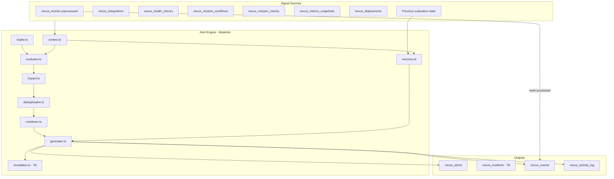

# PROJECT NEXUS — PHASE 7 ALERT ENGINE TECHNICAL DESIGN

**Status:** Approved (with Revision B extensions)  
**Version:** Mark I — Phase 7  
**Scope:** Design only — no implementation  
**Extends:** Phases 0–6 (merged), `docs/NEXUS_ARCHITECTURE_REVISION_B.md`, `docs/NEXUS_IMPLEMENTATION_PLAN.md`

---

## Document history

| Version | Date | Changes |
|---|---|---|
| 1.0 | 2026-06-06 | Initial approved design |
| 1.1 | 2026-06-06 | Revision B: Recovery Alerts, Owner Notes, Impact Score |

---

## 0. Design principles

| Principle | Application |
|---|---|
| **Read signals, write alerts** | Evaluators read `nexus_*` and approved snapshot tables; writes limited to `nexus_alerts`, `nexus_incidents`, `nexus_events`, `nexus_activity_log` |
| **Service role for generation** | Alert engine inserts via `createNexusServiceClient()` (same pattern as health/mission/metrics engines) |
| **Owner for triage** | Owner session updates alert/incident status and notes via RLS |
| **Deterministic rules first** | No AI in Phase 7; rule JSON from `nexus_alert_rules.condition` |
| **Fail safe** | Missing data → skip rule with warning event, never crash the engine |
| **No War Rooms in Phase 7** | Incident creation in 7B only; `lib/war-room/*` deferred to Phase 9 |
| **Recovery is first-class** | Condition clearance emits `alert.recovered` events; recovery is visible, not silent |
| **Impact drives priority** | `impact_score` (1–100) sorts and escalates; severity alone is insufficient |

---

## 1. Alert Engine Architecture

### 1.1 High-level topology



### 1.2 Proposed module layout

```
lib/alerts/
  types.ts              # AlertEvaluationContext, RuleCondition, AlertCandidate
  rules.ts              # Rule registry helpers, condition type union
  context.ts            # Snapshot readers → unified context + previous state
  evaluator.ts          # Evaluate firing rules against context
  recovery.ts           # Recovery rule evaluation + alert.recovered emission
  impact.ts             # impact_score computation (1–100)
  deduplication.ts      # dedupe_key generation + conflict handling
  cooldown.ts           # Per-rule cooldown state
  generator.ts          # Insert alert + emit events
  notes.ts              # Owner notes helpers (metadata schema, validation)
  escalation.ts         # Incident linking rules (7B)
  incident-manager.ts   # Create/update incidents (7B)
  engine.ts             # Orchestrator (runNexusAlertEngine)
  summary.ts            # Owner read models (7C / dashboard prep)
```

**API / cron (Phase 7A):**

```
app/api/cron/nexus/alert-evaluation/route.ts   # CRON_SECRET, runs engine
app/api/nexus/alerts/route.ts                  # Owner GET active + history
app/api/nexus/alerts/[id]/route.ts             # Owner PATCH status + notes
app/api/nexus/incidents/[id]/route.ts          # Owner PATCH status + notes (7B)
```

### 1.3 Alert evaluation flow

**Trigger:** Cron every 5 minutes (Phase 13 schedule), optionally chained after health/mission/metrics crons.

```
1. runNexusAlertEngine()
2. Load previous evaluation state (per rule + scope: last_known_status, last_fired_at)
3. Build AlertEvaluationContext (parallel reads)
4. Load enabled rules from nexus_alert_rules ORDER BY severity DESC, rule_kind ASC
   (firing rules before recovery rules)
5. FIRING PASS — for each firing rule:
   a. Check cooldown
   b. Evaluate condition
   c. If false → continue (recovery pass handles clearance)
   d. Build AlertCandidate + compute impact_score
   e. Dedupe / insert or update nexus_alerts
   f. Emit nexus_event (alert.created or alert.updated)
   g. Record cooldown + update evaluation state
6. RECOVERY PASS — for each recovery rule (see §2):
   a. Detect transition from bad → good vs previous state
   b. If recovery detected:
      - Auto-resolve linked active alert (if still open)
      - Emit nexus_event (alert.recovered)
      - Optionally insert info recovery notice alert (category: recovery)
   c. Update previous state to current good state
7. Process event-driven rules on unprocessed nexus_events; mark processed=true
8. Incident escalation pass (7B only) — uses impact_score (see §5, §6)
9. Return summary
```

### 1.4 Rule execution flow

Rules are **data-driven** from `nexus_alert_rules.condition` JSON. Evaluator dispatches by `condition.type`:

| `condition.type` | Primary data source | Example seeded rule |
|---|---|---|
| `integration_status` | `nexus_integrations.status` | `health.integration.down` |
| `workflow_status` | `nexus_mission_workflows.status` | `mission.workflow.failing` |
| `workflow_slug` | `nexus_mission_workflows` by slug | `mission.signup.blocked` |
| `threshold` + `metric_key` | `nexus_metrics_snapshots` | `revenue.mrr.drop` |
| `threshold` + `source` | Derived from checks / read-only counts | `stripe.webhook.failures` |
| `deployment_status` | `nexus_deployments` | `deploy.production.failed` |
| `recovery.integration_status` | Status transition → healthy | `recovery.integration.stripe` |
| `recovery.workflow_status` | Workflow transition → healthy | `recovery.workflow.messaging` |
| `recovery.metric_threshold` | Metric back within bounds | `recovery.revenue.mrr` |

**Duration gates** (`duration_minutes`): Condition must be continuously true across **K consecutive evaluation cycles** before firing. State stored in `nexus_alert_rules.metadata.evaluation_state` or `nexus_alert_rule_state` table.

### 1.5 Deduplication strategy

**Primary key:** `dedupe_key` on `nexus_alerts` with unique partial index:

```sql
UNIQUE (dedupe_key) WHERE status = 'active' AND dedupe_key IS NOT NULL
```

**Key format:**

```
{rule_id}:{scope}:{scope_id}
```

| Rule scope | `scope` | `scope_id` |
|---|---|---|
| Global metric | `global` | `metric_key` or `none` |
| Integration | `integration` | `supabase`, `stripe`, … |
| Mission workflow | `workflow` | `user_signup`, `messaging`, … |
| Deployment | `deployment` | `deployment_id` or `production` |
| Recovery | `recovery` | `{original_scope}:{scope_id}` |

**On duplicate active alert:** Update `metadata.last_seen_at`, `metadata.evidence`, `metadata.impact_score` (if higher), `updated_at`. Do **not** create a new row.

**Recovery dedupe:** Recovery notices use `recovery:{original_dedupe_key}` — separate from firing alert; auto-resolve or expire after 24h.

### 1.6 Cooldown strategy

- **Source:** `nexus_alert_rules.cooldown_minutes`
- **State:** `metadata.last_fired_at` on rule row or last alert `created_at` for `rule_id`
- **Recovery events:** No cooldown on `alert.recovered` (informational)
- **Exception:** Severity escalation within same dedupe group (critical overrides warning cooldown once per hour)

### 1.7 Escalation strategy

**Phase 7A:** Alert-only escalation (no incidents)

| Escalation | Mechanism |
|---|---|
| Repeat firing | Update existing active alert evidence + impact_score |
| Severity increase | Update `severity` on same alert row if rule severity increased |
| Owner acknowledge | Stops auto-resolve; does not reset cooldown |
| Auto-resolve | Condition clears → `status=resolved` + `alert.recovered` event |

**Phase 7B:** Incident escalation uses `impact_score` (see §5, §6)

---

## 2. Recovery Alerts (Revision B)

### 2.1 Purpose

Recovery alerts close the loop when conditions clear. Without them, owners see problems resolve silently and lose audit trail. Recovery is **informational**, not actionable urgency.

| Layer | Firing | Recovery |
|---|---|---|
| Event | `alert.created` / `alert.updated` | `alert.recovered` |
| Alert row | `category=infra/mission/...`, severity warning/critical | `category=recovery`, severity info |
| Owner UX | Requires action | Confirms restoration; feeds history and memory |

### 2.2 `alert.recovered` events

Emitted to `nexus_events` on every qualified recovery transition.

| Field | Value |
|---|---|
| `source` | `collector` |
| `category` | `recovery` |
| `event_type` | `alert.recovered` |
| `severity` | `info` |
| `title` | Human-readable recovery summary |
| `payload` | See below |
| `correlation_id` | Shared with original firing event/incident when available |

**Payload schema:**

```json
{
  "rule_id": "health.integration.down",
  "recovery_rule_id": "recovery.integration.stripe",
  "scope": "integration",
  "scope_id": "stripe",
  "previous_status": "down",
  "current_status": "healthy",
  "original_alert_id": "uuid-or-null",
  "incident_id": "uuid-or-null",
  "duration_minutes": 42,
  "evidence": {}
}
```

**Constants update (7A implementation):** Add `recovery` to `NEXUS_EVENT_CATEGORIES` in `lib/nexus/constants.ts`.

### 2.3 Recovery rule types

Recovery rules are stored in `nexus_alert_rules` with `metadata.rule_kind = 'recovery'` and a `paired_rule_id` pointing to the firing rule.

| Recovery rule ID pattern | Firing pair | Transition detected |
|---|---|---|
| `recovery.integration.{slug}` | `health.integration.down` / `.degraded` | `down`/`degraded` → `healthy` |
| `recovery.workflow.{slug}` | `mission.workflow.failing` / `.degraded` / `mission.*.blocked` | `failing`/`degraded` → `healthy` |
| `recovery.metric.{metric_key}` | `revenue.mrr.drop`, `growth.signup.drop`, etc. | Metric back within threshold for 1 evaluation cycle |
| `recovery.mission.score` | `mission.score.critical` / `.degraded` | Score back above threshold |

### 2.4 Recovery evaluation flow

```
For each recovery rule:
  1. Read previous_state from evaluation cache (status, metric value, score)
  2. Read current_state from AlertEvaluationContext
  3. If NOT was_bad(previous) OR NOT is_good(current) → skip
  4. Compute duration_minutes = now - first_bad_at
  5. Auto-resolve active alert where dedupe_key matches firing rule scope (system resolve)
  6. Emit alert.recovered event
  7. Insert recovery notice alert (optional but recommended for dashboard):
     - category: recovery
     - severity: info
     - status: active → auto-resolve after 24h OR keep as resolved immediately
     - metadata.recovery_of_alert_id: original alert UUID
  8. Update evaluation state to good
  9. If linked incident in mitigated state → suggest owner resolve (7B)
```

### 2.5 Recovery alert row (notice)

Short-lived informational alert for Active Alerts / History panels.

| Field | Value |
|---|---|
| `category` | `recovery` |
| `severity` | `info` |
| `title` | e.g. "Stripe integration recovered" |
| `message` | e.g. "Integration healthy after 42 minutes degraded" |
| `rule_id` | recovery rule ID |
| `dedupe_key` | `recovery:{original_dedupe_key}` |
| `impact_score` | 1–15 (low — informational) |
| `metadata` | `{ recovery_of_alert_id, duration_minutes, evidence }` |

### 2.6 Seed recovery rules (7A migration)

Add paired recovery rules for all seeded firing rules that represent stateful conditions:

- 6 integration recovery rules (one per integration slug)
- 11 mission workflow recovery rules
- `recovery.mission.score` (score above 70)
- `recovery.revenue.mrr`, `recovery.growth.signups_daily`
- `recovery.stripe.webhook` (failed count back to 0)

**Do not** create recovery rules for one-shot events (e.g. deploy failure — use `deployment_status=ready` as separate firing/recovery pair).

---

## 3. Owner Notes (Revision B)

### 3.1 Purpose

Owners need to annotate alerts and incidents during triage. Notes become the primary human context source for:

- Dashboard alert/incident detail panels (Phase 16+)
- Ask Nexus / memory engine (Phase 11+) — `nexus_ai_memory` entries projected from notes
- Postmortem drafts (Phase 9+)

**Mark I storage:** `metadata.owner_notes` JSON array on `nexus_alerts` and `nexus_incidents`. No new columns in 7A.

### 3.2 Schema: `metadata.owner_notes`

```typescript
type NexusOwnerNote = {
  id: string;              // uuid
  author_id: string;         // profiles.id (platform owner)
  body: string;              // max 4000 chars, plain text Mark I
  created_at: string;        // ISO
  updated_at: string | null; // ISO, set on edit
};

// On nexus_alerts.metadata and nexus_incidents.metadata:
{
  "owner_notes": NexusOwnerNote[]
}
```

### 3.3 API behavior (7A tail / 7B)

| Action | Method | Auth | Behavior |
|---|---|---|---|
| Add note | `POST /api/nexus/alerts/[id]/notes` | owner | Append to `metadata.owner_notes` |
| Edit note | `PATCH /api/nexus/alerts/[id]/notes/[noteId]` | owner | Author or any owner (Mark I: any owner) |
| Delete note | `DELETE /api/nexus/alerts/[id]/notes/[noteId]` | owner | Soft-delete: `metadata.owner_notes[].deleted_at` (optional) |
| Same for incidents | `/api/nexus/incidents/[id]/notes` | owner | Identical pattern |

### 3.4 Side effects on note write

1. Update `nexus_alerts.updated_at` / `nexus_incidents.updated_at`
2. Emit `nexus_event`:
   - `event_type`: `alert.note_added` / `incident.note_added`
   - `category`: `infra` (or alert's category)
   - `severity`: `info`
   - `payload`: `{ alert_id, note_id, author_id }` (no full body in event — body in metadata)
3. Append `nexus_activity_log` entry: `nexus.alert.note_added`

### 3.5 Future memory projection (Phase 11)

When memory engine processes `alert.note_added` / `incident.note_added`:

```
nexus_ai_memory entry:
  memory_type: 'incident_note' | 'alert_note'
  title: "Owner note on {alert.title}"
  content: note.body
  source_id: alert_id | incident_id
  occurred_at: note.created_at
```

Design constraint: Notes must be **owner-only** readable via RLS; never exposed to members or staff admin routes.

---

## 4. Impact Score (Revision B)

### 4.1 Purpose

`impact_score` (integer 1–100) quantifies **business and member harm**, not just technical severity. It enables consistent sorting, escalation, and future AI prioritization.

**Mark I storage:** `metadata.impact_score` on `nexus_alerts` and `nexus_incidents`. Promote to dedicated column in Mark II if query performance requires it.

### 4.2 Scoring guidelines

**Base score from severity:**

| Severity | Base range |
|---|---|
| `critical` | 70–100 |
| `warning` | 40–69 |
| `info` | 10–39 |
| `recovery` | 1–15 |

**Category multiplier (add to base, cap at 100):**

| Category | Bonus | Rationale |
|---|---|---|
| `mission` | +15 | Direct member workflow harm |
| `commerce` / `revenue` | +12 | Revenue and Blackcard impact |
| `infra` | +8 | Platform availability |
| `security` | +10 | Trust and abuse risk |
| `growth` | +5 | Trend signal, rarely urgent |
| `recovery` | +0 | Informational |

**Scope modifiers (add, cap at 100):**

| Modifier | Points | Condition |
|---|---|---|
| Member-blocking workflow | +10 | `user_signup`, `user_login`, `messaging`, `blackcard_purchase` failing |
| Multi-workflow | +5 per additional | ≥2 workflows failing same evaluation |
| Duration | +1 per 10 min | Capped at +15; uses `metadata.first_seen_at` |
| Integration breadth | +8 | ≥2 integrations down simultaneously |
| Metric magnitude | +0–10 | e.g. MRR drop >20% → +10 |

**Formula (Mark I):**

```
impact_score = clamp(1, 100,
  severity_base
  + category_bonus
  + scope_modifiers
  + duration_bonus
)
```

Recomputed on every alert update (repeat firing increases duration bonus).

### 4.3 Examples

| Scenario | Severity | impact_score | Rationale |
|---|---|---|---|
| Supabase down 5 min | critical | 88 | 75 base + 8 infra + 5 duration |
| Messaging degraded 45 min | warning | 62 | 50 base + 15 mission + 4 duration |
| MRR drop 12% | warning | 57 | 50 base + 12 revenue |
| Signup spike (info) | info | 18 | 15 base + 5 growth (capped low) |
| Stripe recovered | info | 8 | Recovery base only |
| 3 workflows failing | critical | 95 | High base + mission + breadth |

### 4.4 Uses of impact_score

| Use | Phase | Rule |
|---|---|---|
| **Active alert sorting** | 7A / dashboard 16 | `ORDER BY impact_score DESC, severity DESC, updated_at DESC` |
| **Incident escalation** | 7B | Create incident if `impact_score >= 75` AND `severity = critical`, OR `impact_score >= 85` any severity |
| **Multi-alert rollup** | 7B | Open incident when sum of top-3 active `impact_score` ≥ 200 within 30 min |
| **War room creation** | 9 (future) | `impact_score >= 90` + critical + duration ≥ 15 min + open incident |
| **AI prioritization** | 12 (future) | Context builder ranks by `impact_score`; notes appended as evidence |

### 4.5 Incident impact_score

When incident created (7B), set `nexus_incidents.metadata.impact_score` = `max(linked alert impact_scores)` at creation time. Update on new linked alerts if higher score arrives.

---

## 5. Alert Categories

### 5.1 Standard categories

| Category | Use |
|---|---|
| `infra` | Integrations, deployments, email, push |
| `mission` | Member workflow health |
| `revenue` / `commerce` | MRR, subscriptions, Blackcard |
| `growth` | Signups, user trends |
| `security` | Login failures, reports, abuse |
| `recovery` | **New** — condition clearance notices |

### 5.2 Category catalog (firing rules)

**Infrastructure:** Supabase down, Stripe degraded, GitHub unavailable, Vercel deploy failure, Resend outage, push backlog.

**Mission Health:** Mission score critical, signup blocked, messaging degraded, meet creation degraded, Blackcard purchase failures.

**Business:** Revenue drop, Blackcard conversion drop, user growth slowdown, churn spike.

**Security:** Login failure spikes, abnormal activity, API failure rate.

**Recovery:** Paired recovery rules for all stateful firing rules (§2).

---

## 6. Alert Lifecycle

### 6.1 Schema vs product states

**DB (`nexus_alerts.status`):** `active`, `acknowledged`, `resolved`, `suppressed`

| Product state | DB mapping |
|---|---|
| open | `active` |
| acknowledged | `acknowledged` |
| investigating | `acknowledged` + `metadata.investigating=true` |
| resolved | `resolved` |
| dismissed | `suppressed` |

### 6.2 Transitions

| Transition | Actor | Side effects |
|---|---|---|
| → acknowledged | owner | `alert.acknowledged` event |
| → investigating | owner | `metadata.investigating=true` |
| → resolved | owner / system | `alert.resolved` event; if system → triggers recovery check |
| → suppressed | owner | `alert.suppressed` event |
| Recovery | system | Auto-resolve + `alert.recovered` event |

---

## 7. Alert Deduplication

See §1.5. Recovery notices use separate dedupe namespace (`recovery:{key}`).

**Burst example:** Stripe down 30 min → 1 active critical alert (updated 6 times), 1 recovery info alert on clearance, 1 `alert.recovered` event.

---

## 8. Incident Creation Strategy (Phase 7B)

**No War Rooms in Phase 7.**

### 8.1 When to create an incident

| Trigger | Create? | Notes |
|---|---|---|
| `impact_score >= 75` AND `severity = critical` | Yes | Primary path |
| `impact_score >= 85` (any severity) | Yes | High harm warnings |
| ≥3 critical alerts, combined impact ≥ 200 in 30 min | Yes | Rollup incident |
| Integration `down` ≥ 10 min | Yes | Duration-gated |
| Mission score < 50 for ≥ 15 min | Yes | `impact_score` typically ≥ 80 |
| Warning-only, impact < 75 | No | Alert only |
| Recovery | No | Event only; may suggest incident resolve |

### 8.2 Alert ↔ incident linking

- Set `nexus_alerts.incident_id` on escalation
- Copy `metadata.impact_score` to incident
- Emit `incident.created` with shared `correlation_id`
- **Do not** create `nexus_war_rooms` (Phase 9)

---

## 9. Alert Severity

| Severity | Meaning | Typical impact_score |
|---|---|---|
| `info` | Notable, non-urgent | 10–39 (recovery: 1–15) |
| `warning` | Degraded or negative trend | 40–69 |
| `critical` | Broken or member-blocking | 70–100 |

Severity is rule-defined; `impact_score` refines priority within a severity band.

---

## 10. Dashboard Readiness (data structures)

### 10.1 Active Alerts panel

```typescript
type NexusActiveAlertsPanel = {
  collected_at: string;
  counts: { critical: number; warning: number; info: number; recovery: number };
  alerts: Array<{
    id: string;
    rule_id: string | null;
    category: string;
    severity: 'info' | 'warning' | 'critical';
    status: string;
    title: string;
    message: string;
    impact_score: number;           // from metadata
    dedupe_key: string | null;
    incident_id: string | null;
    created_at: string;
    updated_at: string;
    owner_notes_count: number;        // metadata.owner_notes.length
    metadata: {
      investigating?: boolean;
      last_seen_at?: string;
      evidence?: Record<string, unknown>;
      recovery_of_alert_id?: string;
    };
  }>;
};
```

**Default sort:** `impact_score DESC`, `severity DESC`, `updated_at DESC`.

### 10.2 Alert History panel

Includes recovery events and `duration_minutes` (fired → resolved).

### 10.3 Alert Trends panel (7C)

Add buckets for `recovery` category and MTTR by `impact_score` decile.

---

## 11. Roadmap (updated)

### Phase 7A — Rule engine + alert generation + recovery + impact

| Deliverable | Details |
|---|---|
| Core engine | evaluator, recovery, impact, dedupe, cooldown, generator |
| Recovery | `alert.recovered` events, recovery rules seeded, auto-resolve on clearance |
| Impact score | Computed on every alert create/update |
| Owner notes API | POST notes on alerts (`metadata.owner_notes`) |
| Cron | `/api/cron/nexus/alert-evaluation` |
| Owner read | `GET /api/nexus/alerts` sorted by impact_score |

### Phase 7B — Incident creation

| Deliverable | Details |
|---|---|
| Incident manager | impact_score thresholds (§8) |
| Owner notes | Notes on incidents |
| Owner PATCH | Alert/incident status + notes |

### Phase 7C — Alert analytics

| Deliverable | Details |
|---|---|
| Trends | Recovery rate, MTTR by impact_score, top rules |
| API | `/api/nexus/alerts/trends`, `/history` |

---

## 12. Data gaps & adapters (unchanged from v1.0)

| Signal | Adapter needed in 7A |
|---|---|
| `mission.health_score` | Compute from mission summary or add snapshot write |
| `blackcard.cancellations_daily` | Add to metrics rollup |
| `login_failures` | Stub until auth signal collector |
| `nexus_deployments` | Vercel webhook (Phase 14) or stub |

---

## 13. Security & operations

| Topic | Design |
|---|---|
| Auth | Cron: `CRON_SECRET`; Owner: `requireOwnerSession()` + rate limit |
| Writes | Service role for engine; owner UPDATE for status/notes |
| PII | Redact evidence via `lib/monitoring/redact.ts`; note bodies owner-only |
| Recovery spam | One `alert.recovered` per scope per clearance transition |
| impact_score tampering | Only service role sets on create/update; owner cannot edit score |

---

## 14. Evaluation context schema (reference)

```typescript
type AlertEvaluationContext = {
  evaluated_at: string;
  previous_state: Record<string, {
    status?: string;
    value?: number;
    first_bad_at?: string;
  }>;
  integrations: Record<string, { status: string; last_check_at: string | null }>;
  mission_workflows: Record<string, { status: string; last_check_at: string | null }>;
  mission_score: number | null;
  metrics: Record<string, { value: number; period_start: string; previous_value: number | null }>;
  recent_events: NexusEventRecord[];
  deployments: Array<{ id: string; environment: string; status: string; started_at: string }>;
  derived: Record<string, number | null>;
};
```

---

## 15. Summary

Phase 7 Alert Engine v1.1 adds three capabilities to the approved design:

1. **Recovery Alerts** — `alert.recovered` events, paired recovery rules, info-level recovery category, auto-resolve on clearance.
2. **Owner Notes** — `metadata.owner_notes` on alerts and incidents; future Ask Nexus memory source.
3. **Impact Score** — 1–100 harm metric for sorting, incident escalation (7B), future war rooms (9), and AI prioritization (12).

Implementation begins with Phase **7A** on `main` after staging QA checklist completion. No code in this document.
