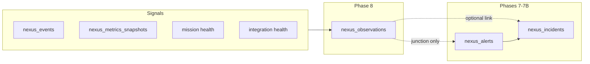

# PROJECT NEXUS — PHASE 8 OBSERVATIONS ENGINE TECHNICAL DESIGN

**Status:** Approved for design review  
**Version:** Mark I — Phase 8  
**Scope:** Design only — no implementation  
**Extends:** Phases 0–7 (merged), `docs/NEXUS_ARCHITECTURE_REVISION_B.md`, `docs/NEXUS_PHASE7_ALERT_ENGINE.md`

---

## Document history

| Version | Date | Changes |
|---|---|---|
| 1.0 | 2026-06-06 | Initial Phase 8 design (post 7B.1 approval) |

---

## 0. Design principles

| Principle | Application |
|---|---|
| **Interpret, don't duplicate** | Observations read signals; they do not re-emit raw telemetry |
| **Answer “what does this mean?”** | Every observation is a plain-language conclusion backed by evidence |
| **Alerts act; observations explain** | Alert engine remains authoritative for owner action; observations provide context |
| **Deterministic Mark I** | Rule-based evaluators only; `source = 'rule_engine' \| 'collector' \| 'manual'` |
| **Fail safe** | Missing inputs → skip rule with `observation.rule.skipped` event, never crash |
| **No AI in Phase 8** | No LLM calls, no `source = 'ai'`, no embeddings |
| **No commands** | Observations may reference alerts/incidents; command suggestions deferred to Phase 10 |
| **No war rooms** | `war_room_id` column exists but remains null in Phase 8 |
| **No dashboard UI** | APIs + read models only; panels deferred to Phase 16+ |
| **Owner feedback loop** | Dismiss / confirm trains future Mark II calibration; stored on row |

---

## 1. Purpose and layer model

Nexus already answers three questions at different layers:

| Layer | Question | Example |
|---|---|---|
| `nexus_events` | What happened? | `mission.workflow.degraded` for `user_login` |
| `nexus_observations` | **What does it mean?** | Mission Health is degraded because login, posts, meets, and messaging are in warning state |
| `nexus_alerts` | Should the owner act now? | WARNING: Mission Workflow Degraded |
| `nexus_incidents` | Is this an operational incident? | OPEN: Multi-alert incident (3 critical alerts) |

**Phase 8 adds the interpretation layer.** Observations synthesize cross-signal context that individual alerts cannot express alone.

### 1.1 Example conclusions (Mark I targets)

| Conclusion | Type | Category | Severity |
|---|---|---|---|
| Mission Health is degraded because login, posts, meets, and messaging are warning | `diagnosis` | `mission` | `warning` |
| Nexus is degraded primarily because GitHub and Vercel tokens are missing | `diagnosis` | `infra` | `warning` |
| Blackcard revenue is active but current MRR is low | `summary` | `revenue` | `info` |
| User growth is improving this week compared to last week | `trend` | `growth` | `info` |
| No current critical incidents exist | `summary` | `infra` | `info` |

---

## 2. Observation types

Uses `nexus_observations.observation_type` with one Mark I extension.

### 2.1 Core types (schema + Mark I usage)

| Type | Meaning | When to use | Example |
|---|---|---|---|
| `summary` | Current-state synthesis | Snapshot of “what is true now” | No critical incidents; MRR below target but Blackcard active |
| `diagnosis` | Multi-signal root explanation | 2+ correlated signals explain a degraded state | Mission degraded because 4 workflows warning |
| `trend` | Directional change over window | Week-over-week, 7d avg comparison | Signups improving vs prior week |
| `anomaly` | Unexpected deviation from baseline | Spike/drop beyond threshold | Push failures 3× normal |
| `correlation` | Temporal co-occurrence | Metric shift near deployment/event | MRR dip within 2h of deploy |
| `regression` | Confirmed worsening | Sustained decline across evaluations | Mission score down 3 consecutive runs |
| `milestone` | Threshold crossed (positive or negative) | Revenue/user count landmarks | 1000th member signup |

### 2.2 Schema extension (Phase 8A migration)

Add `diagnosis` to the `observation_type` check constraint:

```sql
observation_type in (
  'trend', 'anomaly', 'correlation', 'regression', 'milestone', 'summary', 'diagnosis'
)
```

`diagnosis` is the primary type for cross-workflow and cross-integration explanations.

---

## 3. Data sources

Observations are **read-only** over approved Nexus tables. No writes outside `nexus_observations`, junction tables, `nexus_events`, `nexus_activity_log`.

### 3.1 Primary signal sources

| Source table | Fields used | Observation use |
|---|---|---|
| `nexus_mission_workflows` | `slug`, `status`, `display_name`, `last_check_at` | Workflow-level diagnosis, mission summaries |
| `nexus_mission_checks` | `status`, `checked_at`, `details` | Recent failure evidence, success rates |
| Mission score (derived) | Latest check rollup → `mission.health_score` metric | Mission Health headline conclusions |
| `nexus_integrations` | `slug`, `status`, `metadata` | Integration down/degraded diagnosis |
| `nexus_health_checks` | `probe_name`, `status`, `details` | Token-missing, latency, probe failures |
| `nexus_metrics_snapshots` | `metric_key`, `value`, `previous_value`, `period_start` | Trends, MRR, growth, Blackcard |
| `nexus_alerts` | `status`, `severity`, `category`, `rule_id`, `metadata.impact_score` | Context linking; “no critical alerts” summaries |
| `nexus_incidents` | `status`, `severity`, `title`, `metadata.impact_score` | “No open incidents” / incident context |
| `nexus_events` | Recent `event_type`, `category`, `payload`, `occurred_at` | Deploy correlation, activity spikes |
| `nexus_deployments` | `environment`, `status`, `started_at`, `metadata` | Post-deploy correlation rules |

### 3.2 Derived context bundle (`ObservationEvaluationContext`)

Built once per engine run (parallel reads, same pattern as alert engine):

```typescript
type ObservationEvaluationContext = {
  evaluated_at: string;
  mission: {
    score: number | null;
    status: "healthy" | "degraded" | "critical" | null;
    workflows: Record<string, { status: string; display_name: string }>;
    warning_workflows: string[];
    failing_workflows: string[];
  };
  integrations: Record<string, { status: string; issues: string[] }>;
  metrics: Record<string, { value: number; previous_value: number | null }>;
  metric_history: Record<string, Array<{ value: number; period_start: string }>>;
  alerts: {
    active_critical: number;
    active_warning: number;
    active_by_category: Record<string, number>;
  };
  incidents: {
    open_critical: number;
    open_total: number;
    open_ids: string[];
  };
  recent_events: Array<{ id: string; event_type: string; occurred_at: string }>;
  latest_deployment: { id: string; status: string; started_at: string } | null;
};
```

### 3.3 Source → conclusion mapping (seed rules)

| Rule ID | Inputs | Conclusion template |
|---|---|---|
| `obs.mission.health.diagnosis` | mission score + warning workflows | Mission Health is {status} because {workflow_list} are {status}. |
| `obs.infra.integration.diagnosis` | integrations down/degraded + health_check details | Nexus is {status} primarily because {integration_list} {reason}. |
| `obs.revenue.blackcard.mrr.summary` | `blackcard.active` + `revenue.mrr` | Blackcard revenue is active ({n} members) but current MRR is {mrr} ({tier} vs target). |
| `obs.growth.signups.trend` | `growth.signups_weekly` vs prior week | User growth is {direction} this week ({pct}% vs last week). |
| `obs.infra.incidents.clear.summary` | `nexus_incidents` open count by severity | {No current critical incidents exist \| N critical incidents open}. |
| `obs.mission.workflow.degraded` | Single workflow status transition | Member workflow "{name}" is experiencing elevated failure rate. |
| `obs.revenue.decline` | `revenue.mrr` vs 7d avg | Revenue declined {delta_pct}% compared to the 7-day average. |
| `obs.deploy.correlation` | deployment + metric delta within 2h | {metric} shifted {delta_pct}% within 2h of deployment. |
| `obs.growth.signup_completion` | signup funnel metrics (when available) | Signup completion rate appears degraded. |
| `obs.alerts.context.summary` | active alerts by severity | {n} active alerts: {critical} critical, {warning} warning. |

**Note:** Rules with missing signals skip safely (same pattern as alert engine `alert.rule.skipped` → `observation.rule.skipped`).

---

## 4. Confidence scoring

Stored as `nexus_observations.confidence` (`numeric(4,3)`, 0.000–1.000).

### 4.1 Base confidence by rule class

| Rule class | Base range | Rationale |
|---|---|---|
| Direct metric comparison (trend) | 0.82–0.90 | Quantitative, reproducible |
| Multi-workflow diagnosis | 0.85–0.92 | Multiple agreeing signals |
| Integration probe diagnosis | 0.88–0.95 | Explicit probe error messages |
| Deploy correlation | 0.65–0.78 | Temporal, not causal proof |
| Negative/absence summary (“no incidents”) | 0.90–0.98 | Simple count query |
| Milestone | 0.95–0.99 | Threshold fact |

### 4.2 Modifiers (clamp 0.50–0.99)

| Modifier | Δ confidence | Condition |
|---|---|---|
| Complete evidence | +0.03 | All required inputs present |
| Partial evidence | −0.10 | Optional inputs missing |
| Signal agreement | +0.05 | 3+ sub-signals agree |
| Signal conflict | −0.15 | e.g. mission “healthy” but 2 workflows failing |
| Stale data | −0.08 | Source `last_check_at` > 30 min old |
| Low sample size | −0.12 | Metric history < 3 points |

### 4.3 Priority score (sorting, not stored)

For owner APIs and future dashboard:

```
priority = confidence × severity_weight × recency_factor

severity_weight: info=1.0, warning=1.5, critical=2.0
recency_factor: 1.0 (< 1h), 0.9 (< 6h), 0.75 (< 24h)
```

---

## 5. Severity logic

Observation severity is **informational weight**, not a 1:1 mirror of alert severity.

| Severity | Meaning | Typical use |
|---|---|---|
| `info` | Notable context, no immediate action | Positive trends, clear-state summaries, milestones |
| `warning` | Degraded or negative pattern worth attention | Multi-workflow degradation, missing tokens, MRR concern |
| `critical` | Severe interpreted harm (rare in Mark I) | Mission critical + 3+ failing member-blocking workflows |

### 5.1 Severity rules (deterministic)

| Condition | Observation severity |
|---|---|
| Mission status `critical` OR 2+ member-blocking workflows failing | `critical` |
| Mission status `degraded` OR 2+ integrations down/degraded | `warning` |
| Positive trend / absence summary | `info` |
| Single workflow warning (isolated) | `warning` |
| MRR below configurable floor with active Blackcard | `info` (context) or `warning` if below hard floor |

**Mark I cap:** Observations never auto-create alerts at `critical`. Observations do not replace the alert engine. Maximum auto-side-effect is junction linking and optional `nexus_events` emission (`observation.created`).

---

## 6. Lifecycle: supersede, dismiss, confirm

### 6.1 Status values

| Status | Meaning |
|---|---|
| `active` | Current conclusion |
| `superseded` | Replaced by newer observation with same `dedupe_key` |
| `dismissed` | Owner marked as noise / not useful |
| `confirmed` | Owner validated as accurate (Mark II training signal) |

### 6.2 Dedupe and supersede

**Dedupe key format:**

```
{rule_id}:{scope}:{scope_id}
```

| Scope | `scope_id` | Example key |
|---|---|---|
| Global summary | `none` | `obs.infra.incidents.clear:global:none` |
| Mission | `mission.health` | `obs.mission.health.diagnosis:mission:mission.health` |
| Integration | `github` | `obs.infra.integration.diagnosis:integration:github` |
| Metric | `revenue.mrr` | `obs.revenue.decline:metric:revenue.mrr` |
| Trend window | `2026-W23` | `obs.growth.signups.trend:week:2026-W23` |

**On duplicate active observation:**
1. Mark prior row `status = 'superseded'`, set `superseded_by = new.id`
2. Upsert new row as `active` with refreshed `summary`, `evidence`, `confidence`, `occurred_at`
3. Emit `observation.superseded` event (info)

### 6.3 Dismiss and confirm (owner)

| Action | API | DB changes | Side effects |
|---|---|---|---|
| Dismiss | `PATCH` `{ "status": "dismissed" }` | `dismissed_at`, `dismissed_by` | `observation.dismissed` event + activity log |
| Confirm | `PATCH` `{ "status": "confirmed" }` | `metadata.confirmed_at`, `metadata.confirmed_by` | `observation.confirmed` event + activity log |
| Re-activate | Not allowed Mark I | Owner must wait for next engine run | — |

Dismissed observations are excluded from active summaries but kept for history.

### 6.4 Expiration (`valid_until`)

| Type | TTL |
|---|---|
| `summary` (clear-state) | 1 hour — refresh each cron |
| `diagnosis` | 6 hours while condition persists |
| `trend` | 7 days (weekly) or 24h (daily) |
| `milestone` | Never auto-expire; supersede only |

Expired observations auto-transition to `superseded` with `metadata.expired = true` (engine pass, no delete).

---

## 7. Relationship to alerts and incidents



### 7.1 Rules of engagement

| Rule | Detail |
|---|---|
| Observations do not create alerts | Alert engine remains sole firing path for `nexus_alerts` |
| Observations may reference alerts | `nexus_observation_alerts` with `relationship = 'related' \| 'triggered_by'` |
| Observations may link incidents | Set `incident_id` when correlating to open incident; no incident creation |
| Alerts may inform observations | Active alert counts used in summary rules |
| Incidents inform observations | “No critical incidents” reads `nexus_incidents`, not alerts |
| Recovery | When condition clears, supersede diagnosis with positive summary or let TTL expire |

### 7.2 Junction tables (required on create)

| Junction | When populated |
|---|---|
| `nexus_observation_metrics` | Rule used metric snapshots (`baseline`, `current`, `comparison`) |
| `nexus_observation_events` | Deploy correlation, event-driven rules |
| `nexus_observation_alerts` | Diagnosis rules list contributing active alerts |

---

## 8. Architecture

### 8.1 Module layout

```
lib/observations/
  types.ts              # Context, rules, candidates, engine result
  context.ts            # Parallel snapshot readers
  rules.ts              # Rule registry + seed definitions
  evaluator.ts            # Rule evaluation against context
  confidence.ts         # Confidence computation
  deduplication.ts      # dedupe_key + supersede helpers
  generator.ts          # Insert observation + junction refs
  engine.ts             # runNexusObservationEngine() orchestrator
  summary.ts            # Owner read model
```

### 8.2 Engine flow

```
1. runNexusObservationEngine()
2. Build ObservationEvaluationContext (parallel reads)
3. Load enabled observation rules (new table OR seed JSON — see §8.3)
4. For each rule:
   a. Evaluate → match | no_match | skipped
   b. Compute confidence + severity
   c. Dedupe → supersede or create
   d. Write junction refs
5. Expire stale observations (valid_until < now)
6. Emit observation.evaluation.completed + activity log
```

**Trigger position in cron chain:**

```
health-check → mission-health → metrics-rollup → alert-evaluation → observation-engine
```

### 8.3 Observation rules storage

**Mark I recommendation:** `nexus_observation_rules` table (mirrors `nexus_alert_rules`):

```sql
create table nexus_observation_rules (
  id uuid primary key,
  rule_id text unique not null,
  name text not null,
  category text not null,
  observation_type text not null,
  condition jsonb not null,
  enabled boolean default true,
  metadata jsonb default '{}'
);
```

Alternative: seed-only JSON in migration (faster 8A); migrate to table in 8B. Design prefers table for owner read in future.

---

## 9. API design

All owner routes use `requireOwnerSession()` + rate limits (same as alerts/incidents).

### 9.1 Cron

| Method | Path | Auth | Behavior |
|---|---|---|---|
| `GET` | `/api/cron/nexus/observation-engine` | `CRON_SECRET` | Runs `runNexusObservationEngine()` |

**Response:**

```json
{
  "ok": true,
  "evaluated_at": "ISO",
  "rules_evaluated": 12,
  "rules_skipped": [],
  "observations_created": 2,
  "observations_updated": 5,
  "observations_superseded": 3,
  "events_emitted": 8
}
```

### 9.2 Owner read

| Method | Path | Behavior |
|---|---|---|
| `GET` | `/api/nexus/observations` | Active observations sorted by priority; includes 7-day history |
| `GET` | `/api/nexus/observations/[id]` | Detail + junction refs (metric keys, event types, alert titles) |

**List response shape:**

```typescript
type NexusObservationsSummary = {
  collected_at: string;
  counts: { info: number; warning: number; critical: number; active: number };
  active: Array<{
    id: string;
    observation_type: string;
    category: string;
    severity: string;
    confidence: number;
    priority_score: number;
    title: string;
    summary: string;
    rule_id: string | null;
    occurred_at: string;
    valid_until: string | null;
    incident_id: string | null;
    linked_alerts_count: number;
    linked_metrics_count: number;
    evidence: Record<string, unknown>;
  }>;
  recent_history: Array</* same row, superseded/dismissed/confirmed */>;
};
```

### 9.3 Owner triage

| Method | Path | Body | Behavior |
|---|---|---|---|
| `PATCH` | `/api/nexus/observations/[id]` | `{ "status": "dismissed" }` | Dismiss |
| `PATCH` | `/api/nexus/observations/[id]` | `{ "status": "confirmed" }` | Confirm |

No owner notes on observations Mark I (deferred; incidents/alerts already have notes).

---

## 10. Cron design

| Property | Value |
|---|---|
| Path | `/api/cron/nexus/observation-engine` |
| Schedule | `*/15 * * * *` (Phase 13 `vercel.json`; not added in 8A) |
| Auth | `CRON_SECRET` via `isCronAuthorized()` |
| Runtime | `nodejs`, `force-dynamic` |
| Service client | `createNexusServiceClient()` |
| Depends on | metrics-rollup, mission-health, health-check having run first |
| Writes | `nexus_observations`, junction tables, `nexus_events`, `nexus_activity_log` |
| Does not call | AI APIs, Stripe, GitHub, Vercel, command executor |

**Skip safety:** Missing metric history → skip trend rules, emit `observation.rule.skipped`.

---

## 11. Dashboard readiness (data only)

Phase 8 prepares structures; UI is Phase 16.

### 11.1 Observations panel (future)

| Element | Data source |
|---|---|
| Top 5 conclusions | `GET /api/nexus/observations` → `active.slice(0, 5)` by priority |
| Severity badge | `severity` |
| Confidence | `confidence` as % |
| Category tag | `category` |
| Expand → evidence | `evidence` + junction counts |
| Actions | `PATCH` dismiss / confirm |

### 11.2 Cross-panel integration

| Panel | Observation feed |
|---|---|
| Mission Health | `obs.mission.health.diagnosis` linked by category |
| System Health | `obs.infra.integration.diagnosis` |
| Active Alerts | `obs.alerts.context.summary` — explains alert landscape |
| Incidents | `obs.infra.incidents.clear.summary` |

---

## 12. Events and activity log

| Event type | When |
|---|---|
| `observation.created` | New active observation |
| `observation.updated` | Supersede refresh (same dedupe_key) |
| `observation.superseded` | Prior row superseded |
| `observation.dismissed` | Owner dismiss |
| `observation.confirmed` | Owner confirm |
| `observation.rule.skipped` | Missing signal |
| `observation.evaluation.completed` | Engine summary |

Activity log actions: `nexus.observation.*` mirroring event types.

---

## 13. Phase 8 roadmap (8A / 8B / 8C)

### Phase 8A — Rule engine + observation generation

| Deliverable | Details |
|---|---|
| Migration | Add `diagnosis` type; optional `nexus_observation_rules` table + seed rules |
| Core lib | `context`, `evaluator`, `confidence`, `dedupe`, `generator`, `engine` |
| Cron route | `GET /api/cron/nexus/observation-engine` |
| Rules | 6 seed rules from Revision B + 4 new summary/diagnosis rules (§3.3) |
| Junction writes | metrics, events, alerts refs |
| Events | `observation.created`, `observation.evaluation.completed`, `observation.rule.skipped` |
| Tests | Engine unit tests; skip-on-missing-signal; dedupe supersede |

**Out of scope:** Owner APIs, dashboard, AI, commands, war rooms.

### Phase 8B — Owner APIs + triage

| Deliverable | Details |
|---|---|
| `GET /api/nexus/observations` | Summary + history |
| `GET /api/nexus/observations/[id]` | Detail with junctions |
| `PATCH /api/nexus/observations/[id]` | Dismiss / confirm |
| Events | `observation.dismissed`, `observation.confirmed` |
| QA | Owner 200 / non-owner 403 / unauthenticated 401 |

### Phase 8C — Rule expansion + operational QA

| Deliverable | Details |
|---|---|
| Additional rules | Deploy correlation, signup completion, milestone thresholds |
| Expiration pass | `valid_until` auto-supersede |
| Staging QA | Cron chain full run; verify conclusions match live signals |
| Dashboard prep | Finalize `NexusObservationsSummary` for Phase 16 panel |

---

## 14. Explicitly out of scope (Phase 8)

- AI / LLM-generated observations (`source = 'ai'`)
- `nexus_commands` / command suggestions
- `nexus_war_rooms` creation or linking
- Alert or incident creation from observations
- Dashboard UI components
- `vercel.json` cron registration (Phase 13)
- Owner notes on observations
- Automation / external API mutations

---

## 15. QA checklist (for implementation phases)

### 8A

- [ ] `npm run build` passes
- [ ] Observation cron returns 401 without secret
- [ ] Cron returns 200 with secret after metrics/mission/health crons
- [ ] `nexus_observations` rows created for matching rules
- [ ] Duplicate cron run supersedes, does not spam
- [ ] Missing signals skip with `observation.rule.skipped`
- [ ] No writes outside `nexus_*` tables
- [ ] No AI calls

### 8B

- [ ] Owner GET/PATCH works
- [ ] Dismiss / confirm updates status + emits events
- [ ] Auth matrix passes

### 8C

- [ ] Example conclusions from §1.1 producible in staging
- [ ] Junction refs resolve to real metrics/events/alerts
- [ ] Expired observations supersede correctly

---

## 16. Approval gate

Phase 8A implementation may begin after this design is approved. Phases 9+ (war rooms, commands, AI) remain blocked until their respective design/QA gates.
